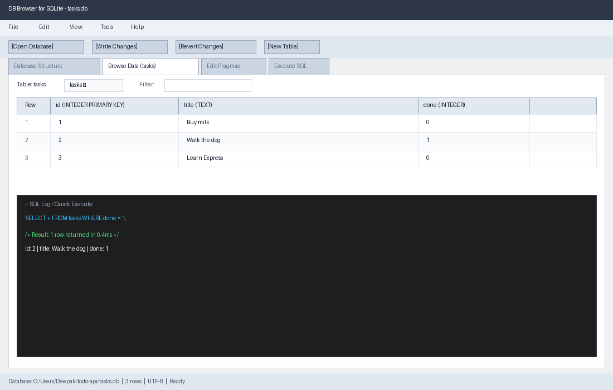

# Task CRUD API with SQLite Persistence

A RESTful Task API built with **Node.js**, **Express**, and **SQLite** (`better-sqlite3`). This assignment transitions our CRUD API from transient in-memory storage to disk-backed persistent storage in a SQLite database (`tasks.db`), ensuring data survives server restarts while keeping the API interface intact.

---

## Why SQLite?

1. **Serverless & Zero Setup**: Unlike Postgres or MySQL, SQLite requires no background service, user credentials, or network configuration. It runs entirely in-process.
2. **Single-File Portability**: The entire database lives in a single file (`tasks.db`).
3. **True Persistence**: Unlike in-memory data that vanishes on server restarts, SQLite writes transactions to disk.
4. **Synchronous & Clean Code**: With `better-sqlite3`, queries execute synchronously without unnecessary `async`/`await` overhead.
5. **Separation of Concerns**: The API routes define *what* the application does; SQLite defines *where* data lives. Storage is just an implementation detail under the hood.

---

## Database Location & Auto-Creation

- **Database File**: `tasks.db` located in the project root.
- **Automatic Setup**: When the application boots, `tasks.db` and the `tasks` table are automatically created if they do not exist.
- **Automatic Seeding**: If the `tasks` table is empty (`COUNT(*) === 0`), three initial example tasks are seeded in a single transaction:
  1. `Buy milk` (done: 0)
  2. `Walk the dog` (done: 1)
  3. `Learn Express` (done: 0)
  Restarting the server checks the row count and does not duplicate seeds.
- **Git-Ignored**: `tasks.db` is included in `.gitignore` so that every clean clone initializes fresh.

---

## Getting Started

### Prerequisites
- [Node.js](https://nodejs.org/) (v18+ recommended)
- npm

### Installation & Run

```bash
# 1. Install dependencies
npm install

# 2. Start the server (one documented command)
npm start
```

The API starts at `http://localhost:3000`.

---

## DB Browser for SQLite Screenshot

The database table and schema viewed in DB Browser for SQLite:



---

## Stage 4: SQL by Hand

The database file was inspected and manipulated directly via raw SQL queries:

```sql
-- 1. List every task
SELECT * FROM tasks;

-- 2. Only completed tasks
SELECT * FROM tasks WHERE done = 1;

-- 3. Total task count
SELECT COUNT(*) AS count FROM tasks;

-- 4. Mark every task completed
UPDATE tasks SET done = 1;

-- 5. Delete all completed tasks
DELETE FROM tasks WHERE done = 1;
```

### Example Hand Query & Result

- **Query Executed**:
  ```sql
  SELECT * FROM tasks WHERE done = 1;
  ```
- **Result Returned**:
  ```json
  [ { "id": 2, "title": "Walk the dog", "done": 1 } ]
  ```
- **Observation**: The query filtered the database on disk, immediately returning only the row where `done` equals 1. Any manual updates in DB Browser are reflected instantly in API calls to `GET /tasks` without restarting the server, proving that SQLite is the single source of truth.

---

## API Reference

All write operations use **parameterized queries** (`?` placeholders) to prevent SQL injection vulnerabilities.

| Method | Endpoint | Description | Status Codes |
|---|---|---|---|
| `GET` | `/health` | Healthcheck endpoint | `200` |
| `GET` | `/docs` | Interactive Swagger API documentation | `200` |
| `GET` | `/tasks` | List all tasks (supports query filtering) | `200` |
| `GET` | `/tasks/:id` | Fetch a single task by ID | `200`, `404` |
| `POST` | `/tasks` | Create a new task (`title` required) | `201`, `400` |
| `PUT` | `/tasks/:id` | Update title or done status | `200`, `400`, `404` |
| `DELETE` | `/tasks/:id` | Remove a task | `204`, `404` |
| `GET` | `/stats` | Aggregate task statistics | `200` |

### Query Parameters for `GET /tasks`

- `search`: Filter tasks whose title contains the substring (`WHERE title LIKE ?`).
  - Example: `GET /tasks?search=milk`
- `done`: Filter by completion status (`WHERE done = ?`).
  - Example: `GET /tasks?done=true` or `GET /tasks?done=false`
- `sort`: Order results (`ORDER BY title ASC` or `ORDER BY id DESC`).
  - Example: `GET /tasks?sort=title`

### Example Responses

**GET /tasks**:
```json
[
  { "id": 1, "title": "Buy milk", "done": false },
  { "id": 2, "title": "Walk the dog", "done": true },
  { "id": 3, "title": "Learn Express", "done": false }
]
```

**GET /stats**:
```json
{
  "total": 3,
  "completed": 1,
  "pending": 2
}
```

---

## Stretch & Design Insights

- **Storage as an Implementation Detail**: The client receives identical JSON responses and status codes as Assignment 1. Automated endpoint tests written for the in-memory API pass without changing a single line of test code, proving that underlying storage architecture does not leak into the public API contract.
- **Indexes**: Added index `idx_tasks_done` on `tasks(done)` and `idx_tasks_title` on `tasks(title)` to accelerate `WHERE` filtering and `ORDER BY` sorting as the dataset scales.
- **Atomic Transactions**: Seeding is enclosed in `db.transaction()` ensuring all-or-nothing execution, preventing partial database corruption.